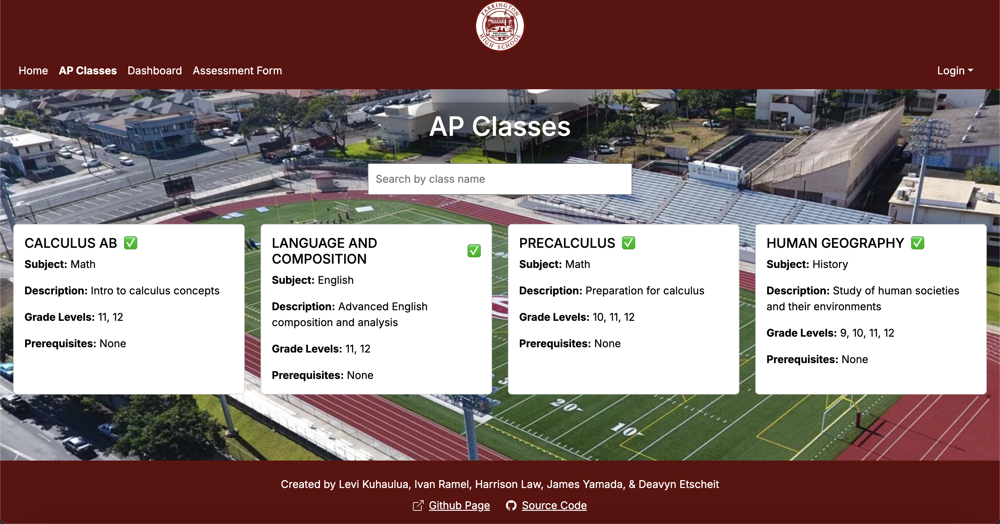

<!--rounded float-start pe-4-->

"A design that doesn’t take change into account risks major redesign in the future." - Erich Gamma

## Do patterns design themselves or do designs do it?
I have been made aware that a common interview question pertaining to software engineer positions would be, "What are design patterns?", which they then follow up on by saying, "What design patterns have you used in your own code?". Now if I'm being honest, as it stand I would have no idea how to answer this let alone what they are talking about in regards to *design patterns*. But that is what this essay is all about, finding out more about them and how it could benefit me more if I knew other patterns.

## To design or not design, that is the question
Which may sound odd, because it is, just like the subtitle, design patterns are confusing concepts at first but once learned about and implemented in the design process will one learn that they have been doing this from the very start. Design patterns are a generalized, reusable solution to common problems that occur in the development process. Now, when you hear this, you may relate it to functions. I know I did. But, while this is mostly correct, the function itself is not the design pattern but how it's organized. Essentially, functions are the materials used to make a house, while a design pattern is the blueprint that guides workers in making said house. This means that while design patterns need a function to help build it, the function itself necessarily does not need the design pattern.

Taking all that into consideration, why should we use them? I'd figure you know by this point, but let's just list them for the ones not paying *attention*

- They are proven solutions, so most of the time you don't have to stress out on how to implement something
- They save time on development as you can use a proven way to solve your problem
- It helps organize your code for better readability for both you and other developers
- They are reusable so one solution to a problem may well be a solution to the next
- They are easy to scale to other problems if the original solution vaguely fits your next problem

## Have I seen you somewhere before?
Now that we are familiar with design patterns, and how useful they can be, how have I been using them? More specifically, have I used them before without knowing? The answer to whether or not I have been using them all along is an absolute *YES*. This whole class has been preparing us as software engineers, and that field is an ever changing one so it should come to no surprise that we learn topics, whether we know it or not, weeks in advance, and design patterns are no different.

Now what are some design patterns that I have been using? This answer actually applies to most if not all the students in ICS 314, as the most common design pattern we have been using is the next.js application template made by our very own ICS 314 professor. At first it was a requirement as it has most of the stuff we needed in order to learn and practice learning web development, frameworks, etc. But when it came to our final project, I assume most of us gravitated towards using the application template rather than making our final project from scratch as it was something we were familiar with and cut down the initial design since we already knew what it looked like.

## But I was just a tool, wasn’t I? Something you could shape, break, and throw away when it suited you.
Here are some examples of design patterns I used in my group's final project. Note: as of writing this the project is still currently in development.

Milestone 2 Progress (AP Classes Page):

Here we have the current version, as of milestone 2, of the AP Classes page for my group's final project. This essentially a slightly reworked version of digits part 3 cards where they displayed contact info in the card

Digits 3 Cards:

## End of the line
In conclusion, design patterns are a very useful tool not just in software development but in any profession and in life if you think about it. Having a proven solution that works can benefit anyone no matter where they are in their life. Like having a proven way to cook scrambled eggs, or a way to assemble a computer, it's up to the person and how they perform their task.
