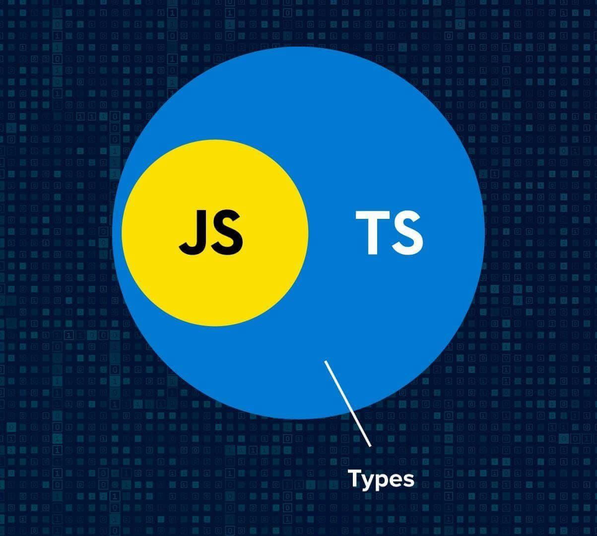

## A "New" Experience
When I heard that we were going to learn TypeScript in ICS 314, I initially thought it wouldn’t be too challenging. I had already learned a few programming languages—Java, C, and C++—with Java being the one I was most familiar with. Since Java shares some similarities with JavaScript, particularly in syntax and object-oriented concepts, I assumed the transition would be smooth. And because TypeScript is a superset of JavaScript, I figured I just needed to brush up on JavaScript and learn a few new TypeScript features. It should be easy, right?

That illusion quickly vanished after the first week of ICS 314. As I began relearning JavaScript, I realized just how much I had forgotten since first encountering it in high school. On top of that, I was surprised by the overwhelming number of new features introduced in TypeScript. The learning curve was steeper than I expected.

Once I got more comfortable with TypeScript, I began to appreciate its design—especially the features that I now feel should have been in vanilla JavaScript all along. Static typing, in particular, stood out. Every other language I’ve studied at UH Mānoa required me to explicitly declare data types for variables and functions. JavaScript didn’t, and I never questioned that until I used TypeScript. The structure and discipline that static typing brings made my code feel more reliable and easier to debug.

Another advantage I noticed is how little setup is required to get started with TypeScript. For example, printing “Hello, World!” is simple and concise:

Javascript/Typescript:
```javascript
console.log("Hello World");
```

It’s straightforward—one line that clearly expresses the desired output. Compare that to 

C:
```c
#include <stdio.h>

int main() {
    printf("Hello, World!\n");
    return 0;
}
```

While the C version isn’t very long, it's noticeably more verbose. This difference becomes more significant when working on larger projects. TypeScript allows for quicker iteration and readability, which makes development more efficient.


## The Language to Save us All?
While it’s still too early for me to definitively judge TypeScript from a software engineering perspective, I can say that despite the challenges, I see its long-term value. Mastering this language won’t be easy, but I believe the effort will pay off. I hope that, in time, I can confidently say whether TypeScript is a good fit for the software industry I plan to enter.

## WOD can I say?

Ah, the dreaded WOD. But before diving into that, I want to touch on the concept of Athletic Software Engineering (ASE). Personally, I think it’s a refreshing and effective teaching method, especially compared to the more traditional approaches I’ve experienced in previous ICS courses. Rather than learning a concept for just one week and applying it to a single assignment, ASE encourages continuous learning and frequent application of knowledge.

Each week, we are tested through what’s known as a WOD—a "Workout of the Day." These timed coding exams assess our understanding of that week’s material. With a strict time limit, usually around 25 to 30 minutes, WODs add an element of pressure that traditional assignments lack.

For students who are already confident in their programming skills, this might not be a major hurdle. But for someone like me—who typically takes a few hours to build, test, and debug a project—this format has been a significant adjustment. On top of that, I’ll admit that I tend to procrastinate. However, the WODs are slowly helping me break those habits. The two I’ve completed so far have motivated me to study more diligently and explore concepts beyond what’s covered in class. I’m learning to prepare ahead of time, manage my time more effectively, and strive for a deeper understanding of the material.

## Conclusion
This journey into TypeScript and athletic software engineering has been both humbling and eye-opening. It has challenged my assumptions, revealed gaps in my knowledge, and pushed me to adopt better study habits. Though I still have much to learn, I’m excited about the progress I’ve made and eager to continue growing as a programmer.
