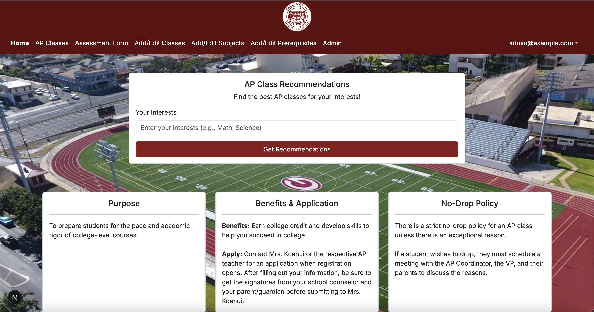
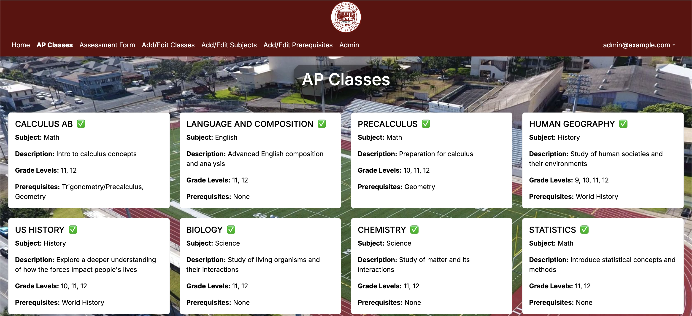

  

This project came about after one of our group members, who attended Farrington High School, pointed out that there is little to no recognition of the AP classes offered at the school. So, the aim of this application was to make students more aware of the AP classes available and to allow teachers to easily manage the AP courses they taught.

To achieve this, we leveraged technologies we learned during ICS 314, such as:

- React
- Bootstrap
- Prisma
- AI

As for my contribution, I focused on styling the website. Whether it was the navbar, footer, or how the content was displayed, I worked on it. I enjoyed experimenting with the website's appearance, even though my group sometimes pushed back against it. I aimed to keep the design consistent throughout by using elements like content cards, complementary colors, and a cohesive layout.

Through this experience of working in a group toward a common goal, I learned a lot. From writing descriptive PRs and commit messages to improving my communication skills in a large team setting. I also gained valuable insights into team management and realized it's often better to overestimate a problem rather than underestimate it, which can lead to time loss and rushed solutions.

Here are a few screenshots from the live website:

  

  

  

And for those who want to see the website in its entirety here's the [link](https://apcoursemanager.vercel.app/)!

Along with the [website source code](https://farringtonap.github.io/farrington-ap.github.io/)!
