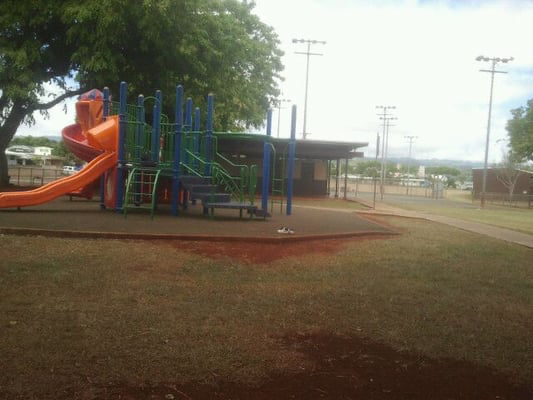

  

This project was during the summer and was about cleaning up a part of Kaala Park which contained a lot of trash from the party from the previous night. I was not alone in this endeavor as my cousin was also there to help. We were doing this as no one from the party had cleaned up their mess and also as an assignment for our summer US History and Government class. The assignment was to assist our community in one way or another that had a positive impact.

We were responsible for cleaning up the trash and putting it in our trash bags with the gloves we had on hand. We collected items varying from empty water bottles, firecracker wrappers, paper plates, etc. We split up the work by covering different sections of the park. I covered the playgrounds and bathroom area. It seemed that the trash was more concentrated on the sides of the fences.

This project was mainly about apperciating the community and taking care of it, like how the land takes care of us as we should do in return. Another part of this experience that I had not considered until it happened was the people in the surrounding houses to notice us picking up the trash. Many of the neighbors offered us water bottles and food for our efforts. This made me appreciate the community even more and considered cleaning up the park every so often.
